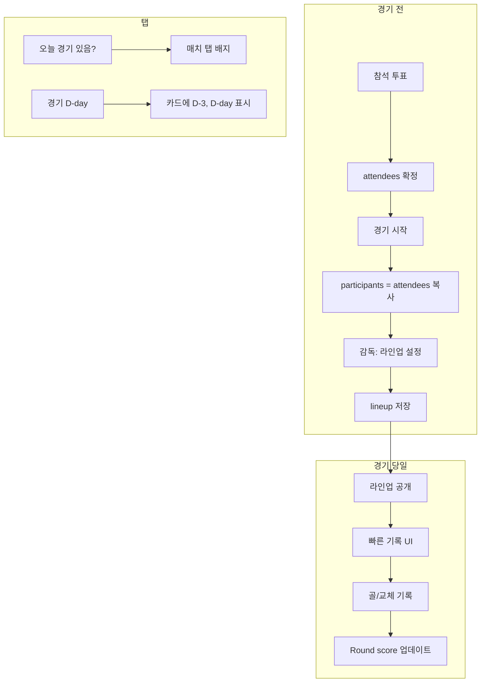

# 경기 매치 고도화 계획

> 옵시디언에 넣어서 관리용. 구현 시 참고.

## 개요

경기 탭 시간 기반 활성화, D-day 표시, 참석자 기반 라인업(감독 설정), 빠른 기록 UI, 라운드별 스코어 표시, 경기 생성, 상대팀 수정을 구현. **MVP/경비는 제외.**

---

## 1. 스키마 확장

### Match 문서 (`teams/{teamId}/matches/{matchId}`) 추가 필드

| 필드 | 타입 | 설명 |
|------|------|------|
| `lineup` | Array\<String\> | 선발 순서 (UID 배열, 앞 N명이 필드) |
| `lineupSize` | Number? | 필드 선수 수 (기본 5, 풋살) |
| `captainId` | String? | 당일 주장 UID (감독이 지정) |

- `participants`: 기존 필드. **attendees와 동일하게** 경기 시작 시 자동 동기화
- 라인업은 `lineup`으로 별도 관리. 감독이 `attendees` 중에서 선택해 순서 지정
- 라인업 공개: 현재 시각 >= 경기 시작 시각 (`date` + `startTime`) 일 때 공개

### Round 문서

- 기존 `score: {our, opp}` 활용
- RoundModel에 `score` 필드 추가 (현재 Firestore에만 있고 엔티티에 없음)

---

## 2. 데이터 흐름

---

## 3. 구현 항목

### Phase A: 기반 작업

- **A-1** Round 스코어 표시 (엔티티/모델/UI)
- **A-2** Match 스키마 확장 (lineup, lineupSize, captainId)

### Phase B: 탭 활성화 + D-day

- **B-1** 매치 탭 배지 (오늘 경기 개수)
- **B-2** D-day 표시 (홈, 매치탭, 경기 상세)

### Phase C: 라인업 + 참가자 자동 배정

- **C-1** 경기 시작 시 participants = attendees 동기화
- **C-2** 라인업 설정 UI (감독 전용, 드래그 순서, lineupSize 설정)
- **C-3** 라인업 표시 (경기 시작 시각 이후 공개)

### Phase D: 빠른 기록 UI

- **D-1** 골 빠른 기록 (선수 칩 1탭)
- **D-2** 교체 빠른 기록 (OUT → IN)
- **D-2b** 상대팀 골 빠른 기록 (1탭, 득점자/어시 없음)
- **D-3** 현재 필드 선수 추정 (교체 기록 기반)

### Phase E: 경기 생성 + 상대팀 수정

- **E-1** 경기 생성 페이지
- **E-2** 상대팀 수정

### Phase F: UI/UX 정리

- **F-1** 입력 검증 및 피드백
- **F-2** 라운드별 데이터 정리

---

## 4. 구현 순서

1. A-1, A-2
2. B-1, B-2
3. C-1, C-2, C-3
4. D-1, D-2, D-2b, D-3
5. E-1, E-2
6. F-1, F-2

---

## 5. 확정 사항

### 5.1 선발 인원

- **경기마다 다름** → `match`에 `lineupSize`(또는 `fieldPlayers`) 필드 추가
- 기본값 5 (풋살), 필요 시 7 등으로 설정 가능

### 5.2 라인업 공개 시점

- **경기 시작 시간**에 공개
- `match.date` + `match.startTime` 조합으로 "경기 시작 시각" 계산
- 현재 시각 >= 경기 시작 시각 → 라인업 공개

### 5.3 매치 탭 배지

- **오늘 경기** = `match.date`가 오늘인 경기 (아직 안 시작했어도, 진행 중이어도, 끝났어도 포함)
- 배지: 오늘 경기 개수 표시

### 5.4 seedSampleMatch

- **역할**: 예정 경기가 없을 때 테스트용 샘플 경기 자동 생성
- **경기 생성 UI 생기면**: 샘플 자동 생성은 제거 (사용자가 직접 경기 생성)

### 5.5 감독/코치 역할

- SCHEMA.md에 `coach` 역할 추가 (이미 코드에는 있음)

### 5.6 상대팀 골 기록

- **상대팀 골도 기록** 필요
- **우리팀**: 득점자·어시스트 (있을 수도, 없을 수도)
- **상대팀**: 득점자/어시스트 정보 없음 → "상대팀 골" 버튼 1탭으로 +1만 기록

---

## 6. 파일 변경 요약

| 작업 | 파일 |
|------|------|
| Round 스코어 | round.dart, round_model.dart, match_detail_page.dart |
| Match 스키마 | match.dart, match_model.dart, match_remote_data_source.dart |
| 탭 배지 | main_shell.dart, match_providers.dart |
| D-day | home_page.dart, match_tab_page.dart, match_detail_page.dart |
| participants 동기화 | round_record_data_source.dart, match_remote_data_source.dart |
| 라인업 UI | match_detail_page.dart, lineup_edit_sheet.dart (신규) |
| 빠른 기록 | match_detail_page.dart, record_modals.dart |
| 경기 생성 | match_create_page.dart (신규), app_router.dart |
| 상대팀 수정 | match_detail_page.dart, match_remote_data_source.dart |
